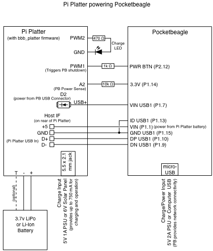
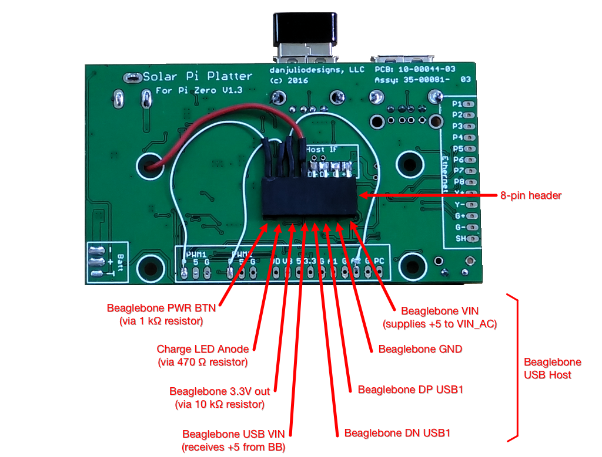
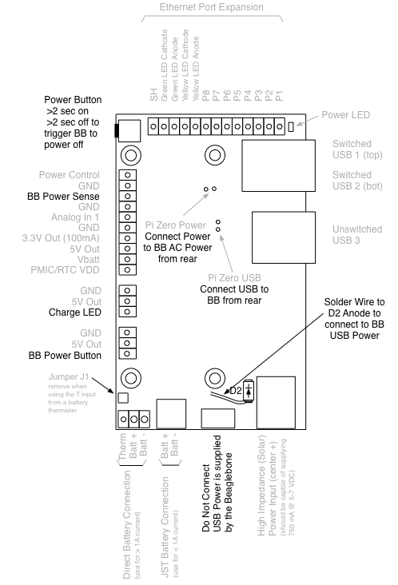
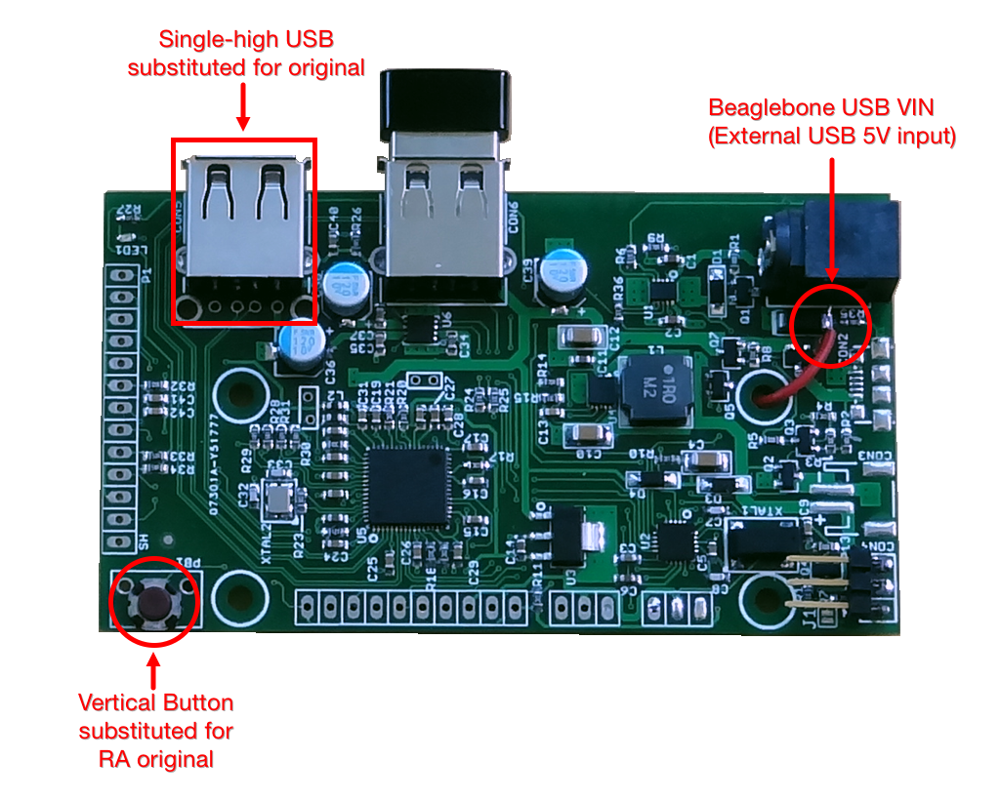

# Pi Platter for Beaglebone Hack
The Beaglebone Black and Pocketbeagle's have a [hardware design](https://groups.google.com/forum/#!category-topic/beagleboard/pocketbeagle/fm3O6nm06c8) that makes it impossible to use their built-in PMIC to charge a LiPo battery while they are shut down.  I wrote new firmware for my [Solar Pi Platter](https://github.com/danjulio/rocketblue-automation/tree/master/pi_platter) design to allow it to act as both a power management and expansion board for the Pocketbeagle for use in my thermal imaging camera.  It might be useful for other applications as well.

This directory contains instructions and supporting files to take a Solar Pi Platter and modify it for use with a Pocketbeagle.  The modified Pi Platter provides the following functions.

* LiPo Battery Charging using a 5V 1A power adapter with 5.5x2.1 mm jack or USB power through the Pocketbeagle's Micro-USB connector.
* 5V power for the Pocketbeagle with auto-shutdown on low battery.
* Soft power-on/off control with power pushbutton and software control.
* Charge LED output.
* Hardware real-time clock with alarm that runs when the Pocketbeagle is powered off.
* High-performance USB Hub with three USB ports. Two USB ports can be power switched by software.
* Analog input.
* Optional Ethernet port

Additional and useful information about the Solar Pi Platter that also applies to this modification can be found in the link above.

## New Pi Platter Firmware
The Pi Platter uses a Microchip PIC16F1459 to provide control functionality.  It appears as a USB CDC-class serial device to the Beaglebone through the USB Hub.  It also implements the real-time clock and alarm functionality using an external 32 kHz crystal and power from the attached LiPo battery.

The original Solar Pi Platter firmware was modified and is included here.  A portable Microchip MPLAB-X project can be found in the ```bbb_platter.X``` subdirectory including all source code.  You will need the MPLAB C compiler to build the source.

A precompiled hex file is also available (```bbb_platter.X.production.hex```).  This can be programmed into an existing Solar Pi Platter using a PIC Programmer such as the Pickit 3 and instructions found in the file ```pi_platter_firmware_upgrade.pdf```.

A board with this firmware pre-loaded can also be obtained from my [tindie store](https://www.tindie.com/products/globoy/mppt-solar-charger-for-intelligent-devices/).  You will be responsible for making the hardware modifications to support the Pocketbeagle.  With the code here and schematic in the original respository you are welcome to build your own, perhaps integrated into another project.

### Firmware Functionality
The modified firmware provides most of the functions of the original Solar Pi Platter and adds power management functionality to allow the Pocketbeagle to operate from a LiPo battery and charge the battery while the system is powered off.

The following functions were removed from the Solar Pi Platter firmware to support the Beaglebone power management.

1. Analog Input 2
2. PWM Outputs
3. Watchdog timer

A complete description of firmware functionality and command interface available through the USB interface can be found in the file ```bbb_platter_instructions_v1_0.pdf```.

### License
The modified firmware for the Pi Platter is released under the GNU [General Public License (GPL) Revision 3](https://www.gnu.org/licenses/gpl-3.0.en.html).

## Hardware Modifications
The Pi Platter is connected to the Pocketbeagle using seven connections shown below.  An additional output can be used for a LED lit while the battery is charging.  Note that care should be taken as two of the connections are the USB interface.  In theory one must be extremely careful to match impedances but I have found USB wiring to be fairly forgiving.  The signals provide the following functionality.

* Route power from the Pocketbeagle's Micro-USB connector to allow it to provide system power to the Pi Platter.
* Allow the Pi Platter to simulate a power-button press on the Pocketbeagle to initiate controlled shutdowns.
* Allow the Pi Platter to sense when the Pocketbeagle is running by monitoring its 3.3V output (which is shut off when the Pocketbeagle shuts down).
* Provide 5V power to the Pocketbeagle when power is being supplied by the LiPo battery or the 5.5x2.1mm jack on the Pi Platter.
* Connect the Pocketbeagle's host USB port to the Pi Platter USB Hub to allow it to communicate with the Pi Platter, USB peripherals and optional ethernet interface.





All but one connection to the Pi Platter may be obtained using headers or expansion pads.  The wire from the Pocketbeagle's Micro-USB socket to the Pi Platter must be soldered to the anode of diode D2 on the Pi platter as show below.  If you do not intend to power the system using the Pocketbeagle's Micro-USB connection then this wire can be omitted (power can be supplied through the Pi Platter's 5.5x2.1mm jack).





Note that I replaced the default right-angle power button, PB1, with a small vertical button to better fit the thermal imaging camera case I designed for the use of this board.  I also removed the double-high USB connector CON5 and substituted a single USB connector.  These changes are not necessary unless you wish to use the case design as-is.

### Battery Connection
Either of the two battery connections may be used.  Jumper J1 should be removed if you use an optional 10k thermistor in the battery for charge temperature monitoring.

### Power on sequencing
The system may be powered on from the following sources.

1. Pressing the Power Button on the Pi Platter for more than 2 seconds.
2. Pocketbeagle 3.3V power coming up because power is being supplied by the Pocketbeagle Micro-USB port.
3. RTC Alarm
4. Pi Platter auto-restart (if enabled) on charged battery after low-battery shutdown.

### Power off sequencing
The Pi Platter firmware monitors the 3.3V output from the Pocketbeagle to determine if it has been shutdown (the kernel will disable the Pocketbeagle PMIC as the final step during a shutdown).

Pressing the Power Button on the Pi Platter for more than 2 seconds when it is powered will initiate a shutdown sequence.  The ```bpd``` daemon (see below) detects the shutdown sequence has been initiated and executes a ```shutdown``` command on the Pocketbeagle.  When the 3.3V power is shut down by the Pocketbeagle the Pi Platter shuts itself down.

If the 3.3V power is not removed within 30 seconds the Pi Platter shuts down to handle the case where the Pocketbeagle shutdown process is hung or ```bpd``` is not running.

The Pi Platter will also shut itself down if it sees the 3.3V power removed at any time to handle the case where some other process or the user initated a shutdown on the Pocketbeagle.

### Notes about using the 5.5x2.1mm jack for power
This power input is best used for charging or powering a system for short periods of time.

Power from the 5.5x2.1mm jack - originally designed for high-impedance power sources like solar panels - is routed through the Pi Platter's charger to the battery and from the battery through the boost converter to generate 5V for the system.  The charger is limited to 750 mA.  Battery charging current is limited to what is left after the system requirements and heavy system requirements may actually discharge the battery while power is supplied from this connector.  In addition, the TI charge controller used on the Pi Platter implements a 10 hour timer on its fast charge (high current) cycle and will reduce current after 10 hours.  Use the Pocketbeagle Micro-USB connector if the system should remain active for long periods of time.

### Notes about using Pocketbeagle Micro-USB 5V for power
The wire connecting Pi Platter D2 anode to the Pocketbeagle Micro-USB USB VIN allows the system to be powered via a USB cable to a computer or USB power supply.  Connecting to a computer may be useful since the Pocketbeagle can provide a network connection over the USB interface.

In this case the PMIC in the Pocketbeagle is supplied with 5V directly from its USB connector on the VIN\_USB pin *and* the 5V routed through the Pi Platter on the VIN\_AC pin.  Since VIN_USB should have less loss, the Pocketbeagle PMIC will select this input to power the board.

The Pi Platter will enable its USB Bypass.  The USB Bypass requires a USB voltage of at least 4.7 volts to remain enabled (otherwise it switches on its 5V Boost converter running from the battery - the same as power through the 5.5x2.1mm jack).  The Pi Platter also decreases charge current as the USB voltage is reduced.  It is very easy to cause the Pi Platter to switch out of USB Bypass mode or reduce the charge current to a low level because of wire resistance in most USB cables and in the wiring between the Pocketbeagle and the Pi Platter.  For this reason it is suggested that if you use the Pocketbeagle USB connector to supply power then you use a slightly higher voltage, say 5.1-5.2 volts.  The supply should be able to provide at least 1.5A to both power the system and charge the battery (or only connect to lower power USB supplies when the battery is charged).  The Pi Platter Status register, accessible thorugh the USB interface, indicates if USB Bypass is enabled or not.

In addition, while power is applied to its Micro USB connector, the Pocketbeagle will immediately switch back on if it is shutdown.  For this reason it isn't possible to use the soft power-off functionality when using the Micro USB connector to supply power since the Pi Platter depends on the 3.3V output of the Pocketbeagle going away to determine that it has been shut down.  In fact since the Pi Platter firmware implements a 30 second hard-shutdown (to handle a hung Pocketbeagle) you will end up in a condition where the Pi Platter is off but the Pocketbeagle is on.   Remove the USB power before attempting to shut down a system.

## Supporting Software
The Pi Platter appears as a CDC-class USB serial device (e.g. ```/dev/ttyACM0```).  It provides a simple command/response interface.  The Linux programs for accessing the Solar Pi Platter have also been ported to the Beaglebone and can be found in ```utilities```.

* ```talkbp``` - Utility allowing configuration of the real-time clock and issuing commands to the Pi Platter.
* ```bpd``` - Daemon providing auto-shutdown functionality and optional network access to the Pi Platter.

See the document ```bbb_platter_instructions_v1_0.pdf``` for a complete list and description of the commands and responses.

### talkbp
```talkbp``` is designed to run on the Beaglebone and allow communication with the Pi Platter board either through the pseudo-tty created by the ```bpd``` daemon or the USB hardware port directly associated with the Pi Platter if ```bpd``` is not running.  It provides a simple command line interface to send commands to (and get responses from) the Pi Platter.  It also provides some commands to make managing time with the Pi Platter's RTC easier.

It uses udev to be able to idenfity which hardware serial device belongs to the Pi Platter (via the USB VID, PID and product strings associated with the new firmware).


#### Building

A prebuilt binary is included here but building is very easy:

    gcc -o talkbp talkbp.c -ludev

The compiled binary may be copied to /usr/local/bin.

    sudo mv talkbp /usr/local/bin

You may have to set appropriate permissions (you will have to do this if you just copy the prebuilt binary from git to /usr/local/bin).

    sudo chmod 775 /usr/local/bin/talkbp

libudev-dev must be installed to build :

    sudo apt-get update
    sudo apt-get install libudev-dev


#### Usage

Type ```talkbp -u``` or ```talkbp -h``` for a list of command line options.

#### Basic commands

ASCII command strings to be sent to the Pi Platter using the '-c <string>' command.  For example to read the battery voltage and get the status

    talkbp -c B
    talkbp -c S

Or to set the restart enable

    talkbp -c C7=1

```talkbp``` will echo any message (such as a WARN or ERR message) pending from the Pi Platter when it connects.  It will also echo back any received responses for a command.


#### Time management

The Pi Platter RTC may be set from the Beaglebone's clock (once it has been set) using the command.

    talkbp -s

The Beaglebone clock may be set from the Pi Platter RTC using a response in the linux ```date``` command (for example when booting the Beaglebone without any network connectivity).

    sudo date $(talkbp -t)

A human readable form of the Pi Platter date can be read using the '-f' command.

    talkbp -f

An wakeup alarm time, using the linux time format ("+%m%d%H%M%Y.%S") can be set using

    talkbp -a <alarm timespec>

A wakeup time using a delta second value past the current RTC time value.

    talkbp -d <delta seconds>

Note that both methods of setting a wakeup time do not enable the wakeup alarm.  This must be done using the "C0=1" command.

    talkbp -c C0=1

Viewing the wakeup time currently set in the Pi Platter in a readable form.

    talkbp -w


### bpd
```bpd``` is a daemon program designed to run on the Beaglebone.  It allows the system to execute a controlled shutdown in the case of a critically low battery voltage (that has triggered the Pi Platter to start a count-down to powering down the entire system).  This may be important to protect the Pocketbeagle's SD-card filesystem from corruption that can occur when power is removed from a running system.  It does this by connecting to the hardware serial port associated with the Pi Platter (like ```talkbp```, it uses udev to figure this out) and looks for the WARN string sent by the Pi Platter for critical battery detection.  Since it "commandeers" the hardware serial port, it also provides additional mechanisms for user application code to communicate with the Pi Platter.  It always creates the pseudo-tty ```/dev/bb-platter``` which can be treated like a traditional serial port device file.  It can optionally also create a TCP socket for network communication with the Pi Platter.

#### Building

A prebuilt binary is included here but building is very easy:

    gcc -o bpd bpd.c -ludev

The compiled binary should be copied to /usr/local/bin.

    sudo mv bpd /usr/local/bin

You may have to set appropriate permissions (you will have to do this if you just copy the prebuilt binary from git to /usr/local/bin).

    sudo chmod 775 /usr/local/bin/bpd

libudev-dev must be installed to build as with ```talkpb```.

#### Usage

```bpd``` should be started as a daemon at start-up.  The easiest way to do this is to include somethine like the following in /etc/rc.local.

    # Start the Pi Platter Daemon
    /usr/local/bin/bpd -p 23000 -r -d &

It is also possible to create a conf file in /etc/init or a startup script in /etc/init.d.

#### Command line options

bpd takes the following command line arguments:

    -d : Run as a daemon program (disconnecting from normal IO, etc).  bpd can be run as a traditional process without this argument.

    -p netport : Enable a TCP socket connection on the specified port.  This is required to enable socket communication with bpd.  Exclude this line to only enable /dev/pi-platter as a mechanism to communicate with the Solar Pi Platter.

    -m max-connections : Specify the maximum number of socket connections that can be made to the port specified with -p.  The default is 1.

    -r : Enable auto-restart on charge (set the Pi Platter "C7=1") after critical battery shutdown.

    -x debuglevel : Set the debug level (bpd uses the system logging facility.  0 is default (only log start-up).  Values of 1 - 3 include progressively more information.

    -h : Display usage and command line options.

#### telnet example

To connect to the TCP socket using telnet from some other computer:

    telnet <Beaglebone IP Address> 23000

Which should result in something like (user types "B" and then "S"):

    Trying <Beaglebone IP Address>...
    Connected to <Beaglebone IP Address>.
    Escape character is '^]'.
    B
    B=4.12
    S
    S=20

Note that opening the socket without additional precautions may be a security risk (anybody could telnet to your Beaglebone and shut it down).  That's why ```bpd``` makes this an option.


### Questions?

While I don't expect many people, if anyone, to use this hack, please feel free to contact the author if you have a question - dan@danjuliodesigns.com